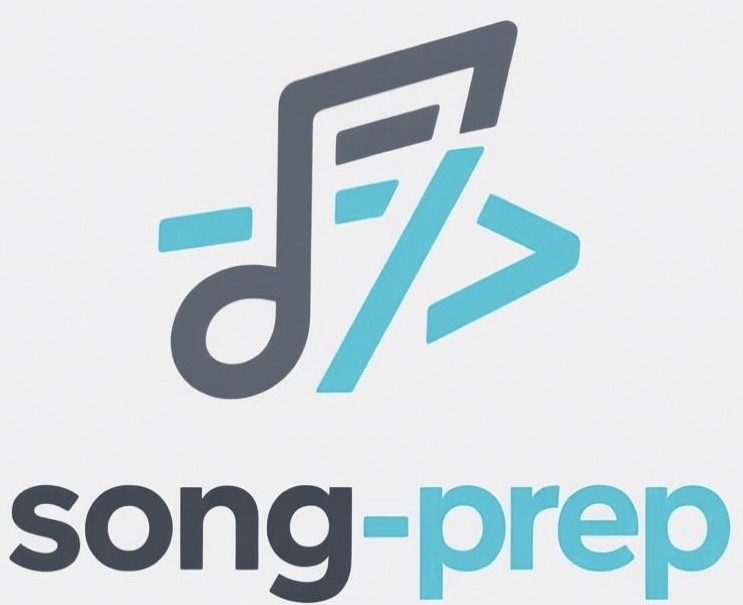

# SongPrep
<p align="center"></p>
<p align="center">
    <a href="https://song-prep.github.io/demo/">Demo</a> &nbsp;|&nbsp; <a href="https://arxiv.org/abs/2509.17404">Paper</a>  &nbsp;|&nbsp; <a href="https://huggingface.co/waytan22/SongPrep-7B">Weight</a>  &nbsp;|&nbsp; <a href="https://huggingface.co/datasets/waytan22/SSLD-200">Dataset</a>
</p>
This repository is the official code repository for SongPrep: A Preprocessing Framework and End-to-end Model for Full-song Structure Parsing and Lyrics Transcription. SongPrep is able to analyze the structure and lyrics of entire songs and provide precise timestamps without the need for additional source separation. In this repository, we provide the SongPrep model, inference scripts, and checkpoints trained on the Million Song Dataset that support both Chinese and English.


## Evaluation
Results are reported in low Diarization Error Rate (DER) for structure parsing and Word Error Rate (WER%) for lyrics transcription.
| Model            | #Params | WER | DER |
|:----------------:|:-------:|:--------:|:--------:|
| SongPrep   | 7B | **23.9%** | **18.0%** |
| Gemini-2.5   | - | 29.2% | 94.6% |
| Seed-ASR         | 12B+ | 104.1% | - |
| Qwen3-ASR       | - | 33.3% | - |
| Qwen-Audio    | 8.4B | 232.7% | - |


## Installation

### Start from scratch

You can install the necessary dependencies using the `requirements.txt` file with Python>=3.8.12 and CUDA>=11.8:
```bash
pip install -r requirements.txt
```

If your Python<=3.9, you can use pip to install fairseq,
```bash
pip install fairseq==0.12.2 --no-deps
```
else it is recommended to install it on wheels. For example Python==3.11 can use [liyaodev/fairseq](https://github.com/liyaodev/fairseq/releases/tag/v0.12.3.1)；
```bash
pip3 install fairseq-0.12.3.1-cp311-cp311-linux_x86_64.whl
```

## Usage
To ensure the model runs correctly, please **download the weight** from the original source at [Hugging Face](https://huggingface.co/waytan22/SongPrep-7B), and save it into **root directory** of the project.

Once everything is set up, you can run the inference script using the following command:
```bash
python3 run.py -i your_wav_path
```

## Citation
```
@misc{tan2025songpreppreprocessingframeworkendtoend,
      title={SongPrep: A Preprocessing Framework and End-to-end Model for Full-song Structure Parsing and Lyrics Transcription}, 
      author={Wei Tan and Shun Lei and Huaicheng Zhang and Guangzheng Li and Yixuan Zhang and Hangting Chen and Jianwei Yu and Rongzhi Gu and Dong Yu},
      year={2025},
      eprint={2509.17404},
      archivePrefix={arXiv},
      primaryClass={eess.AS},
      url={https://arxiv.org/abs/2509.17404}, 
}
```

## License
The code and weights in this repository is released in the [LICENSE](LICENSE)  file.


